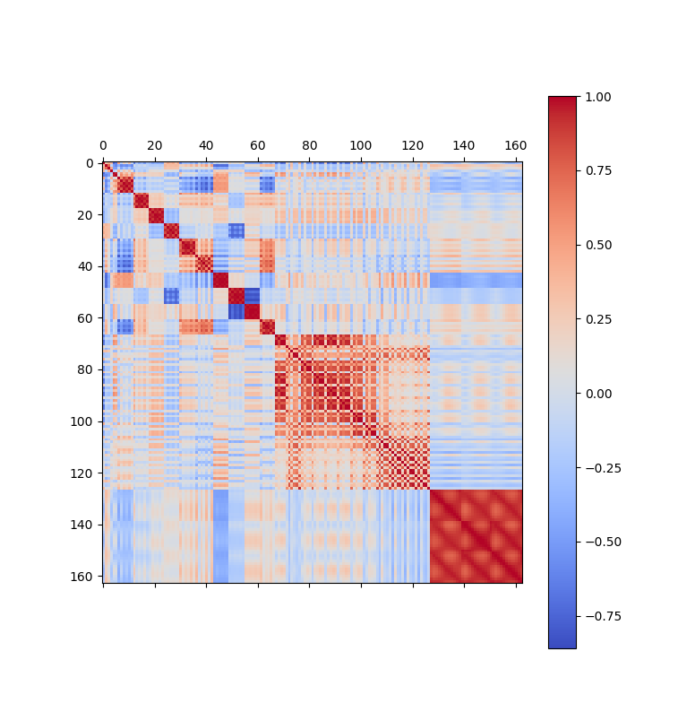
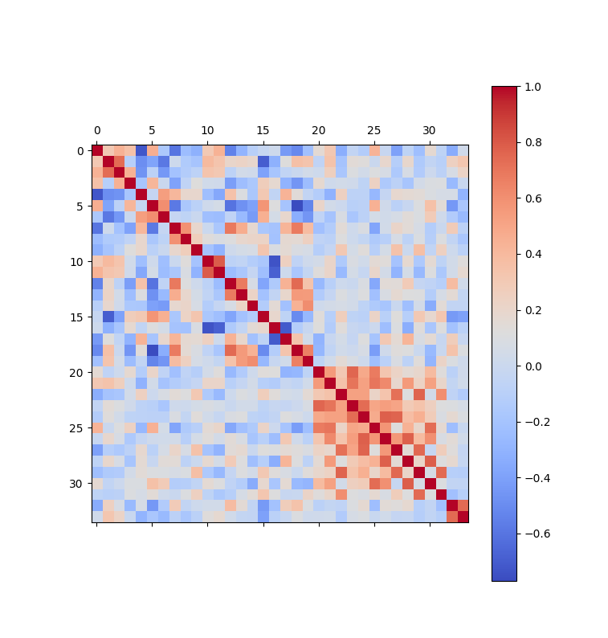

The library provides functions for reducing data covariance. 

## Functions:

1. ```python
   xspare(x, attention_threshold=0.5, elimination_threshold=1., elimination_count_threshold=None, return_columns=False)
   ```
   - `x`: Dataset to compress.
   - `attention_threshold`: Value between `0` and `1`. Columns with correlation coefficient above this threshold are considered redundant.
   - `elimination_threshold`: Value between `0` and `1`. If a column is similar to `elimination_threshold` proportion of all columns, it is eliminated.
   - `elimination_count_threshold`: If specified, a column is eliminated if it is similar to `elimination_count_threshold` other columns.
   - `return_columns`: If `True`, return a boolean numpy array indicating which columns to keep; otherwise, return a transformed matrix.

## Example:
```python
column_mask = xspare(x, attention_threshold=0.8, elimination_count_threshold=2, return_columns=True)
```

Here is the `elimination_count_threshold` set to 2, because each columns is already similar to itself.

The transformed dataset features only 33 columns instead of 163. The 33 columns are less linearly dependant and therefore provide a smoother surface for searching a global optima. 

### Original dataset:

Original dataset                      |  Transformed dataset
:------------------------------------:|:-------------------------:
 | 
